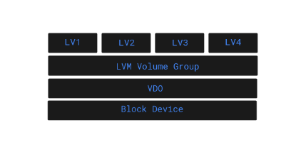
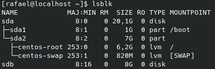
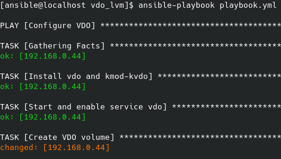
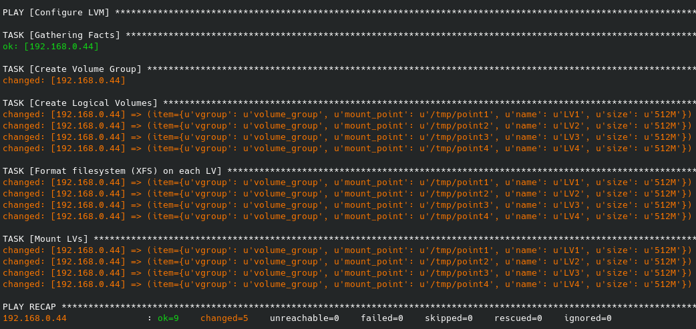
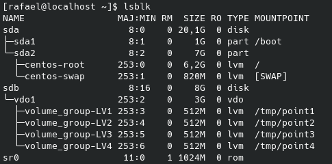
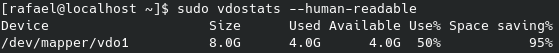
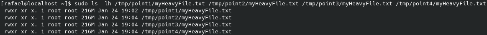
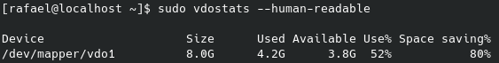

# VDO Automated with Ansible

## This project shows how to build LVM logical volumes over VDO (Virtual Data Optimizer) with automation via Ansible!

## Ansible
* Automation is crucial these days, with complex IT environments that often need to scale too quickly for system administrators and developers to keep up if they had to do everything manually. At this point, a series of automation tools comes in, one of them being Ansible.

* Ansible is an open source automation tool used to configure servers, install software, and perform a wide variety of IT tasks from a central location. Is considered a CMS (Configuration Management System). With ansible, one central computer, the Ansible Control Node, will make a connection via ssh to exceute commands on the clients. 

* Ansible uses Playbooks, which generate python scripts, to manage computers. Playbooks are idempotent, which means that they always give you the same result, even if circumstances have changed on the managed computers.

## VDO (Virtual Data Optimizer)
* It is another advanced storage solution offered in RHEL 8. VDO is designed to reduce disk space usage on block devices by applying deduplication capabilities. VDO creates volumes by implementing deduplication on top of any existing block device type. On top of the VDO device you would create a file system or use it as a physical volume in an LVM configuration.

* Deduplication is a technique to reduce the consumption of storage resources by eliminating multiple copies of duplicate blocks. Instead of writing the same data more than once, the VDO detects each duplicate block and records it as a reference to the original block. The VDO maintains a mapping of logical block addresses used by the storage layer above the VDO to physical block addresses used by the storage layer in the VDO.

* The VDO layer is placed on top of an existing block storage device such as a local disk, RAID device, encrypted devices. The storage layer, such as file systems and LVM logical volumes, is placed on top of a VDO device.

## Hands On
The idea for this project is the implementation of the following structure:

  

* The block device used for this project will be /dev/sdb, seen in the image below:

  

- On the master node, execute the playbook with: `ansible-playbook playbook.yml`. 
The result for the first play is:

  

In my case, the packages were already installed and the service was started and enabled. Only the VDO creation task caused a change on the managed machine.

The result for the second play is:

  

As can be seen, all LVM configuration, formatting and mounts were successfully performed.

The `lsblk` command show what we expect:

  

We can check the generated VDO volume with the following command: `vdostats --human-readable`

  

We can see that 4GB has already been taken. This is because the Universal Deduplication Index has already been written to disk. It is basically a database that keeps a record of plate fingerprints and their locations. This is what makes deduplication possible. So using VDO on small disks or with data that doesn't get at least 10% deduplication will actually be less efficient than using that storage as a regular volume.

Note: If during the creation of the VDO volume you see the message "Device /dev/sdb excluded by a filter", execute the command `wipefs -a /dev/sdb` on the managed nodes, or even better, adapt your playbook.

## Testing VDO

To test the VDO deduplication feature, I copied a big text file (216MB) in the 4 logical volumes.

  

As we can see, the increase in disk space corresponds to just one copy!

  

